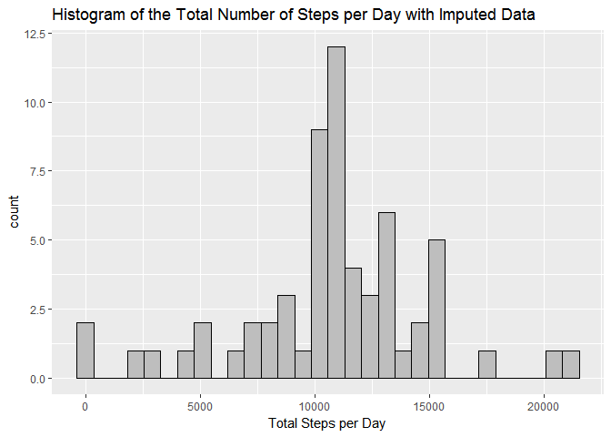

# Reproducible Research: Peer Assessment 1

## Loading and preprocessing the data

In this section, we load the data and convert the class of date into Date.  

```r
library(dplyr)
```

```
## 
## Attaching package: 'dplyr'
```

```
## The following objects are masked from 'package:stats':
## 
##     filter, lag
```

```
## The following objects are masked from 'package:base':
## 
##     intersect, setdiff, setequal, union
```

```r
library(ggplot2)
activity <- read.csv("activity.csv", na.strings = "NA")
activity$date <- as.Date(activity$date, "%Y-%m-%d")
```

## What is mean total number of steps taken per day?
Calculate the total number of steps taken per day.  

```r
Total.Steps.PerDay <- summarize(group_by(activity, date), Total.Steps = sum(steps))
```

Make a histogram of the total number of steps taken each day.

```r
q <- ggplot(data = Total.Steps.PerDay, aes(x = Total.Steps))
q <- q + geom_histogram(bins = 30, color = "black", fill = "grey", na.rm = TRUE)
q <- q + xlab("Total Steps per Day")
q <- q + ggtitle("Histogram of the Total Number of Steps per Day")
print(q)
```

<!-- -->

Calculate and report the mean and median of the total number of steps taken per day.  

```r
Mean.Total.Steps.perDay <- mean(Total.Steps.PerDay$Total.Steps, na.rm = TRUE)
Median.Total.Steps.perDay <- median(Total.Steps.PerDay$Total.Steps, na.rm = TRUE)
```
The mean of the total number of steps per day is 10766.  
The median of the total number of the steps per day is 10765.  

## What is the average daily activity pattern?

Make a time series plot (i.e. type = "l") of the 5-minute interval (x-axis) and the average number of steps taken, averaged across all days (y-axis)

```r
Mean.Steps.Interval <- summarise(group_by(activity, interval), Mean.Steps = mean(steps, na.rm = TRUE))
q1 <- ggplot(data = Mean.Steps.Interval, aes(x = interval, y = Mean.Steps))
q1 <- q1 + geom_line(color = "blue", lwd = 1)
q1 <- q1 + ggtitle("Average Daily Activity Pattern")
q1 <- q1 + xlab("Time Intervals (minutes)") + ylab("Mean Steps")
print(q1)
```

<!-- -->

Which 5-minute interval, on average across all the days in the dataset, contains the maximum number of steps?

```r
Max.Interval <- filter(Mean.Steps.Interval, Mean.Steps == max(Mean.Steps))$interval
```
The interval containing the maximum number of steps is 835.

## Imputing missing values

Calculate and report the total number of missing values in the dataset (i.e. the total number of rows with NAs).

```r
Total.Nas <- sum(is.na(activity$steps))
```
The total number of missing values in the dataset is 2304.  
 
Use the mean for that 5-minute interval to impute missing values. 
Create a new dataset that is equal to the original dataset but with the missing data filled in.  

```r
Activity.Imputed <- activity
naIndex <- sapply(activity$interval[is.na(activity$steps)], indexList <- function(x){which(Mean.Steps.Interval$interval==x)})
Activity.Imputed$steps[is.na(Activity.Imputed$steps)]<-Mean.Steps.Interval$Mean.Steps[naIndex]
```

Make a histogram of the total number of steps taken each day and Calculate and report the mean and median total number of steps taken per day. 

```r
Total.Steps.PerDay.Imputed <- summarize(group_by(Activity.Imputed, date), Total.Steps = sum(steps))
q <- ggplot(data = Total.Steps.PerDay.Imputed, aes(x = Total.Steps))
q <- q + geom_histogram(bins = 30, color = "black", fill = "grey", na.rm = TRUE)
q <- q + xlab("Total Steps per Day")
q <- q + ggtitle("Histogram of the Total Number of Steps per Day with Imputed Data")
print(q)
```

<!-- -->

```r
Mean.Total.Steps.perDay.Imputed <- mean(Total.Steps.PerDay.Imputed$Total.Steps, na.rm = TRUE)
Median.Total.Steps.perDay.Imputed <- median(Total.Steps.PerDay.Imputed$Total.Steps, na.rm = TRUE)
```

After imputing the missing value, the mean of the total number of steps per day is 10766.  
The median of the total number of the steps per day is 10766.  

Do these values differ from the estimates from the first part of the assignment? What is the impact of imputing missing data on the estimates of the total daily number of steps?


```r
Comparision <- data.frame(row.names = c("Daily Total Mean Steps", "Daily Total Median Steps"), Original = c(format(Mean.Total.Steps.perDay, scientific=FALSE, digits = 0), format(Median.Total.Steps.perDay, scientific=FALSE, digits = 0)), Imputed = c(format(Mean.Total.Steps.perDay.Imputed, scientific=FALSE, digits = 0), format(Median.Total.Steps.perDay.Imputed,scientific=FALSE, digits = 0)))
Comparision
```

```
##                          Original Imputed
## Daily Total Mean Steps      10766   10766
## Daily Total Median Steps    10765   10766
```

Imputing missing data with the mean of the 5-minute interval only introduces no difference on the mean total daily number of steps, and only 1 step difference on the median total daily number of steps, compared with the value estimated in the first part of the assignment. However, there is a big difference in the histogram on the second bin after 10000 steps, whose count was around 3.75 in part one, to around 12 with imputed data. 

## Are there differences in activity patterns between weekdays and weekends?

Create a new factor variable in the dataset with two levels - "weekday" and "weekend" indicating whether a given date is a weekday or weekend day.  

```r
activity$day <- weekdays(activity$date)
dayconvert <- function(x){
        if (x == "Saturday" | x == "Sunday" )
                x <- "Weekend"
        else
                x <- "Weekday"
        x
}
activity$day <- sapply(activity$day, dayconvert)
```

Make a panel plot containing a time series plot (i.e. type = "l") of the 5-minute interval (x-axis) and the average number of steps taken, averaged across all weekday days or weekend days (y-axis).  

```r
Mean.Steps.Interval.Weekday <- summarise(group_by(activity, interval, day), Mean.Steps = mean(steps, na.rm = TRUE))
q2 <- ggplot(data = Mean.Steps.Interval.Weekday, aes(x = interval, y = Mean.Steps))
q2 <- q2 + geom_line(color = "blue", lwd = 1)
q2 <- q2 + facet_wrap(~day, ncol = 1)
q2 <- q2 + ggtitle("Average Daily Activity Pattern")
q2 <- q2 + xlab("Time Intervals (minutes)") + ylab("Mean Steps")
print(q2)
```

<!-- -->
